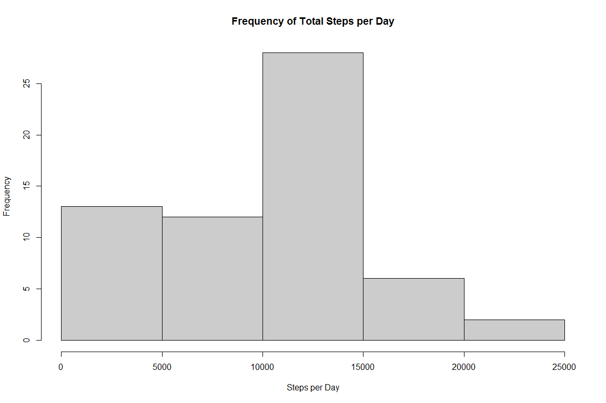
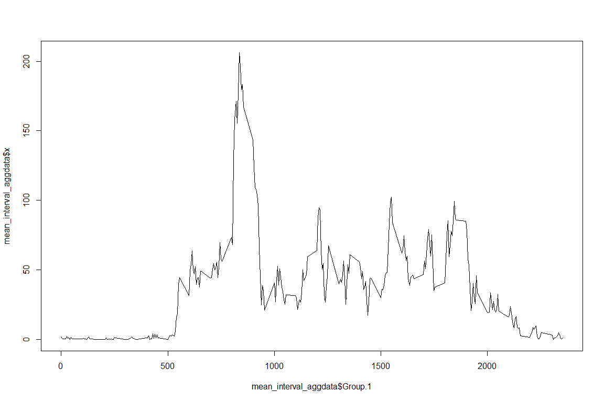
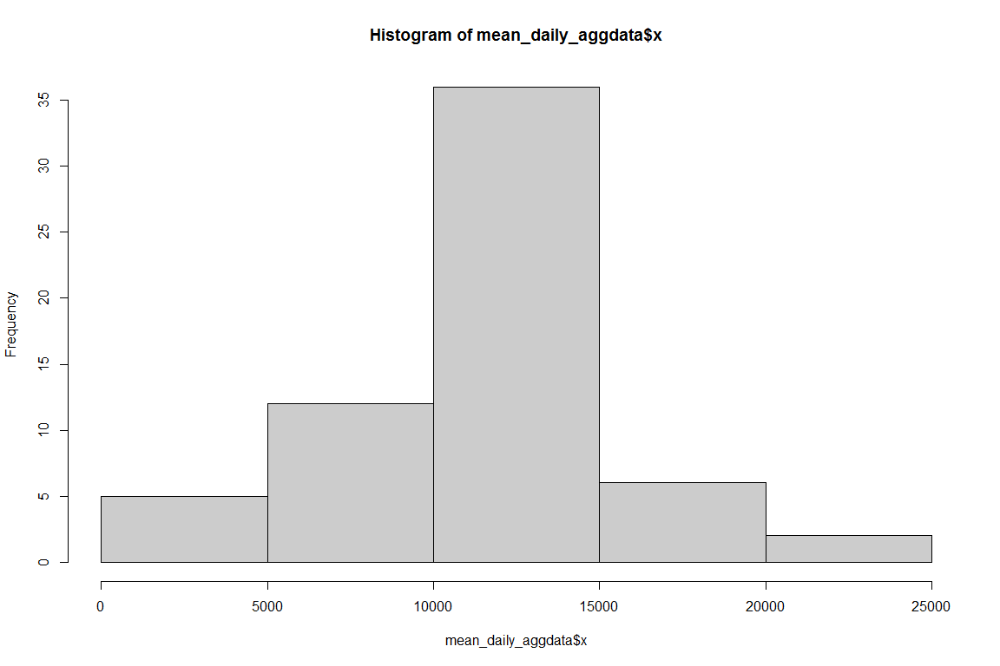
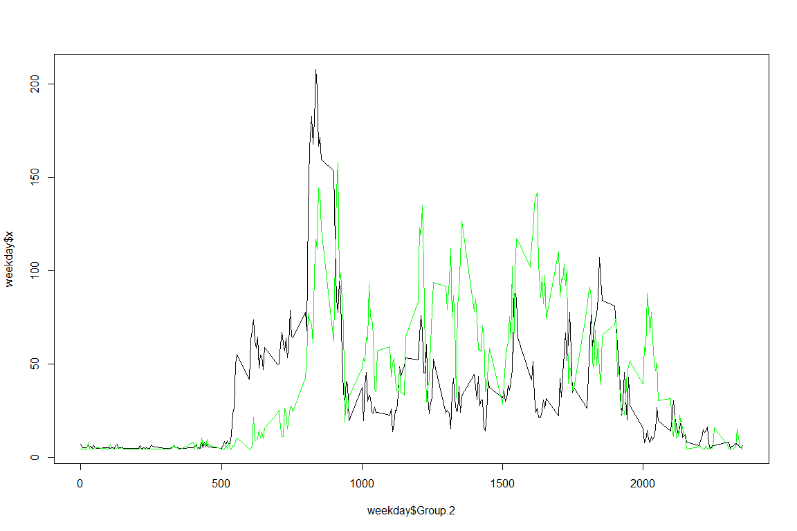

# Reproducible Research: Peer Assessment 1


## Loading and preprocessing the data

```r
act <- read.csv("activity.csv")

mean_daily_aggdata <- aggregate(act$steps, by=list(act$date), FUN=mean, na.rm=TRUE)
```


```r
mean_interval_aggdata <- aggregate(act$steps, by=list(act$interval), FUN=mean, na.rm=TRUE)
```

## What is mean total number of steps taken per day?
Here is a histogram of the number of steps taken each day:

```r
hist(mean_daily_aggdata$x, col="grey80")
```

 

Here is the mean and median of the number of steps taken each day:

```r
mean(mean_daily_aggdata$x, na.rm=TRUE)
```

```
## [1] 37.3826
```

```r
median(mean_daily_aggdata$x, na.rm = TRUE)
```

```
## [1] 37.37847
```

## What is the average daily activity pattern?
Here is a time-series plot of the average number of steps taken per 5-minute interval:


```r
plot(mean_interval_aggdata$Group.1,mean_interval_aggdata$x, type="l")
```

 

The interval that contains the greatest number of steps is 8:35AM, with approximately 206 average steps.

```r
mean_interval_aggdata[mean_interval_aggdata$x > 200,]
```

```
##     Group.1        x
## 104     835 206.1698
```

## Imputing missing values
There are 2304 missing values for steps in the original dataset.


```r
sum(is.na(act$steps))
```

```
## [1] 2304
```

One strategy for filling in a value for these NAs is the global mean.  Here is one way to do that:

```r
act$steps[is.na(act$steps)] = mean(act$steps, na.rm=TRUE)
```

Now that we have inputed values for NAs into the dataset, here is the new histogram:

```r
mean_daily_aggdata <- aggregate(act$steps, by=list(act$date), FUN=mean, na.rm=TRUE)

hist(mean_daily_aggdata$x, col="grey80")
```

 

```r
mean(mean_daily_aggdata$x, na.rm=TRUE)
```

```
## [1] 37.3826
```

```r
median(mean_daily_aggdata$x, na.rm = TRUE)
```

```
## [1] 37.3826
```

The mean does not change because we added over 2000 values to the dataset that are all exactly the mean,  The median changes to the mean, again because we added so many centrally-located values to the dataset, there is a strong chance that the median would become the aadded value, which is the mean in this case.


## Are there differences in activity patterns between weekdays and weekends?

First, we need to create a day-of-week and weekday-vs-weekend variable:


```r
act$date_as_date <- as.Date(as.character(act$date), "%Y-%m-%d")
act$weekday <- weekdays(act$date_as_date)
act$week_time <- "weekday"
act$week_time[act$weekday == "Saturday"] <- "weekend"
act$week_time[act$weekday == "Sunday"] <- "weekend"
```

Now we need to aggregate based on weekend vs. weekday and interval:

```r
aggdata3 <- aggregate(act$steps, by=list(act$week_time,act$interval), FUN=mean, na.rm=TRUE)

weekday <- aggdata3[aggdata3$Group.1=="weekday",]

plot(weekday$Group.2,weekday$x, type="l")

weekend <- aggdata3[aggdata3$Group.1=="weekend",]

points(weekend$Group.2, weekend$x, type="l", col="green")
```

 

Looking at the chart, we see that there is less steps taken in the 5-9am period on weekends, but a lot more steps taken in the afternoon and evening.

